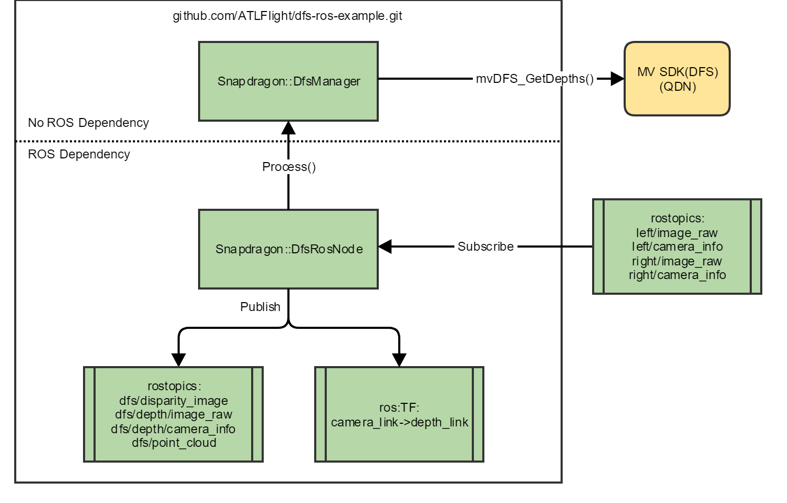

# Snapdragon Flight DFS ROS Sample Code

This repo provides sample code and instructions to run depth-from-stereo (DFS) as a ROS node on the [Qualcomm Snapdragon Platform](https://developer.qualcomm.com/hardware/snapdragon-flight)<sup>TM</sup>. 

This example assumes that you are familiar with ROS framework.  If you are new to ROS, refer to [ROS Start Guide](http://wiki.ros.org/ROS/StartGuide) to get started.

1. [Stereo vision background](#stereo-vision-background)
1. [High-level block diagram](#high-level-block-diagram)
1. [Setup and build process](#setup-and-build-process)
    * [Pre-requisites](#pre-requisites)
        * [Platform BSP](#platform-bsp)
        * [Install ROS on Snapdragon platform](#install-ros-on-snapdragon-platform)
        * [Install Snapdragon Machine Vision SDK](#install-snapdragon-machine-vision-sdk)
        * [Install Machine Vision SDK license](#install-machine-vision-sdk-license)
    * [Clone and build sample code](#clone-and-build-sample-code)
    * [Set up the image publisher](#set-up-the-image-publisher)
    * [Calibrate the stereo cameras](#calibrate-the-stereo-cameras)
1. [Run sample code](#run-sample-code)
    * [Launch DFS ROS node](#launch-dfs-ros-node)
    * [Verification](#verification)
1. [Achieving higher frame rates](#achieving-higher-frame-rates)

## Stereo vision background

For background on the fundamentals of computer stereo vision, please see this Wikipedia entry: https://en.wikipedia.org/wiki/Computer_stereo_vision.

## High-level block diagram


## Setup and build process

Currently, only on-target (i.e. on the Snapdragon Flight<sup>TM</sup> Board) building is supported.

### Pre-requisites

#### Platform BSP

These instructions were tested with version **Flight_3.1.3.1**. The latest version of the software can be downloaded from [here](http://support.intrinsyc.com/projects/snapdragon-flight/files) and installed by following [these instructions](http://support.intrinsyc.com/projects/snapdragon-flight/wiki).

**NOTE**: By default the HOME environment variable is not set.  Set this up doing the following:

```
adb shell
chmod +rw /home/linaro
echo "export HOME=/home/linaro/" >> /home/linaro/.bashrc
```

If you use SSH, the home environment variable should be set correct after the above step. 
If you use ADB, do the following for each session:

```
adb shell
source /home/linaro/.bashrc
```

#### Install ROS on Snapdragon Platform

Refer to [this page](https://github.com/ATLFlight/ATLFlightDocs/blob/master/SnapdragonROSInstallation.md) for instructions for installing ROS on the Snapdragon Flight<sup>TM</sup> platform.

#### Install Snapdragon Machine Vision SDK

* These instructions were tested with version **mv1.0.2**. Download the Snapdragon Machine Vision SDK from [here](https://developer.qualcomm.com/hardware/snapdragon-flight/machine-vision-sdk).
* The package name will be mv\<version\>.deb.  
** Example: *mv_1.0.2_8x74.deb*
* push the deb package to the target and install it.

```
adb push mv<version>.deb /home/linaro
adb shell sync
adb shell
dpkg -i /home/linaro/mv<version>.deb
```

#### Install Machine Vision SDK license

The Machine Vision SDK will need a license file to run.  Obtain a research and development license file from [here](https://developer.qualcomm.com/sdflight-key-req).

The license file needs to be placed at the same location as the MV SDK library, **libmv1.so**.

Push the license file to the target using the following command:

```
adb push snapdragon-flight-license.bin /usr/lib
adb shell sync
```

### Clone and build sample code

#### Clone the sample code
The repo may be cloned from here directly on the target, or cloned on the host computer and then pushed to the target using ADB. The recommended method is to clone directly on the target:

```
adb shell
source /home/linaro/.bashrc
roscd
cd ../src
git clone https://github.com/ATLFlight/dfs-ros-example.git
```

Then, build the code:

```
adb shell
source /home/linaro/.bashrc
roscd
cd ..
catkin_make install
```

**NOTE**: To clean the code, remove the "build" folder:

```
adb shell
source /home/linaro/.bashrc
roscd
cd ../
rm -rf build
```

### Set up the image publisher

The snap_dfs node/nodelet subscribes to the following image and camera_info topics: left/image_raw ([sensor_msgs::Image](http://docs.ros.org/api/sensor_msgs/html/msg/CameraInfo.html)), left/camera_info ([sensor_msgs/CameraInfo](http://docs.ros.org/api/sensor_msgs/html/msg/CameraInfo.html)), right/image_raw ([sensor_msgs::Image](http://docs.ros.org/api/sensor_msgs/html/msg/CameraInfo.html)), and right/camera_info ([sensor_msgs/CameraInfo](http://docs.ros.org/api/sensor_msgs/html/msg/CameraInfo.html)). 

**We recommend that you use this ROS package in conjunction with ([snap_cam_ros](https://github.com/ATLFlight/snap_cam_ros))**, which grabs camera frames from the Snapdragon Flight<sup>TM</sup> camera driver and publishes them over the above ROS topics.

### Calibrate the stereo cameras

To be able to compute depth from a pair of stereo images, the DFS algorithm needs to know the intrinsic parameters (focal length, principal point, radial distortion coefficients) of each camera, and the extrinsic parameters (rotation, translation). If you use the snap_cam_ros package indicated above, then it will read the calibration file from the default location on the board and publish the calibration data over the camera_info topics. 

The calibration procedure is described [here](StereoCalibration.md).

## Run sample code

This example assumes that the user is familiar with ROS. If you are new to ROS, refer to [ROS Start Guide](http://wiki.ros.org/ROS/StartGuide) first to get started.


For convenience, sample ROS launch files have been provided for testing the ROS node. 

### Launch DFS ROS node

You can launch the standalone DFS node/nodelet as follows:

```
adb shell
source /home/linaro/.bashrc
roscd
roslaunch snap_dfs dfs_node.launch        # to launch as a node, or
# roslaunch snap_dfs dfs_nodelet.launch   # uncomment to launch as a nodelet
```

Also provided are launch files to launch the camera publisher (snap_ros_cam) and the DFS node/nodelet (snap_dfs) together:

```
adb shell
source /home/linaro/.bashrc
roscd
roslaunch snap_dfs cams_dfs_node.launch         # to launch as a node, or
# roslaunch snap_dfs cams_dfs_nodelet.launch    # uncomment to launch as a nodelet
```


### Verification

To verify that it is running, run the following command in a different shell instance (optional):

```
adb shell
source /home/linaro/.bashrc
rostopic list
rostopic hz /stereo/dfs/depth/image_raw
```

When running on the GPU at VGA resolution with 32 disparity levels, you should see a rate of around 2.5-3 Hz. 

To further verify the functionality, a ROS visualization tool like RViz can be used to view the image topics (e.g. /stereo/dfs/depth/image_raw for the depth image, /stereo/left/image_raw for the raw left stereo image, or /stereo/dfs/point_cloud).

## Achieving higher frame rates

Here are a few ways to increase the frame rate of DFS:

* Use QVA resolution.

* Run in performance mode, using the provided script, setperfmode.sh.

* Decrease the number of disparity levels. For 28 disparity levels, assuming narrow FOV cameras with focal length ~217, this would correspond to a closest detectable distance of 0.6 m.

Here are some example performance measurements of DFS:

VGA, 32 disparity levels: 2.5 Hz

QVGA, 32 disparity levels: 14 Hz

QVGA, 32 disparity levels, performance mode: 19 Hz

QVGA, 28 disparity levels, performance mode: 22 Hz
