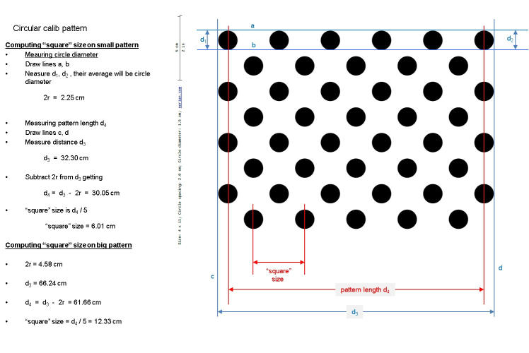

# How to calibrate the stereo cameras on Snapdragon Flight<sup>TM</sup>

* [Pre-requisites](#pre-requisites)
    * [Hardware](#Hardware)
    * [Software](#Software)
    * [Calibration Pattern](#Calibration-pattern)
* [Calibration Process](#calibration-process)
    1. [Start the ROS applications](#start-the-ROS-applications)
    1. [Execute the ROS Camera Calibration procedure](#execute-the-ros-camera-calibration-procedure)

# Pre-requisites

## Hardware

This requires the Stereo Camera Kit from [Intrinsyc](https://www.intrinsyc.com/vertical-development-platforms/qualcomm-snapdragon-flight/).

## Software

Stereo camera calibration for the Snapdragon Flight<sup>TM</sup> platform requires two hosts connected via network. 

A Linux host runs the ROS Camera Calibration tool, while the Snapdragon Flight<sup>TM</sup> runs snap_cam_ros.  The table below lists the requirements for both the hosts.

|     |x86 Linux Host|Snapdragon Flight<sup>TM</sup> platform|
|:----|:-------------|:--------------------------------------|
|OS| Ubuntu 14.04 | [Intrinsyc plaform image Flight_3.1.3.1](http://support.intrinsyc.com/projects/snapdragon-flight/files)|
|ROS version| Install [ROS Indigo](http://wiki.ros.org/indigo/Installation/Ubuntu) | Install [ROS Indigo on Snapdragon Flight<sup>TM</sup>](https://github.com/ATLFlight/ATLFlightDocs/blob/master/SnapdragonROSInstallation.md) |
|ROS packages| Install [ROS Camera Calibration Tool](http://wiki.ros.org/camera_calibration) (sudo apt-get install ros-indigo-camera-calibration)| Install [snap_cam_ros](TODO:add link) Snapdragon Flight<sup>TM</sup> |

## Calibration Pattern

You will need to print a calibration pattern on a large, rigid board (like foam board). The following instructions assume you are using a circular patter, such as [this one](https://nerian.com/support/resources/patterns/). We recommend using size A1 or A2.

Next, you need to measure the "square size" using the instructions in the figure below:



The following calibration process will use the 'asymmetric circles pattern.' *So the square size in this case is half of the actual square size.*

# Calibration Process

The stereo calibration uses the [ROS Camera Calibration Tool](http://wiki.ros.org/camera_calibration) ([link to instructions](http://wiki.ros.org/camera_calibration/Tutorials/StereoCalibration)).

The Linux host and the Snapdragon Flight<sup>TM</sup> board need to be connected via an IP network (wifi or ethernet). 

The snap_cam_ros node runs on the Snapdragon Flight<sup>TM</sup> platform and provides stereo images via ROS topics. The ROS camera calibration tool runs on the Linux host and listens to the stereo image topics. 

## Start the ROS applications

Set up ROS environment variables and start the snap_cam_ros node on Snapdragon Flight<sup>TM</sup>:

```
export ROS_IP=192.168.1.1                       # assumes board is in SoftAP mode
export ROS_MASTER_URI=http://192.168.1.1:11311  # assumes board is in SoftAP mode
source devel/setup.bash                         # assumes you are at the top of your catkin workspace
roslaunch snap_cam_ros stereo.launch
```

Verify that the Linux host is receiving the image topics:

```
export ROS_MASTER_URI=http://192.168.1.1:11311  # assumes board is in SoftAP mode
source /opt/ros/indigo/setup.bash
rostopic hz /stereo/left/image_raw
```

The above should shows the frame rate for the left raw image. You should expect about 30 Hz unless you set a different rate in snap_cam_ros.

Now, start the ROS Camera Calibration tool on the Linux host:

```
rosrun camera_calibration cameracalibrator.py --no-service-check --pattern 'acircles' --size 4x11 --square 0.058 right:=/stereo/right/image_raw left:=/stereo/left/image_raw right_camera:=/stereo/right left_camera:=/stereo/left
```

## Execute the ROS Camera Calibration procedure

Follow the ROS camera calibration procedure as described [here](http://wiki.ros.org/camera_calibration/Tutorials/StereoCalibration).


Once the calibration is done, and click the "COMMIT" button. This will make a service call to "/stereo/left/set_camera_info" and "/stereo/right/set_camera_info" to populate the camera_info topic of each camera with the new calibration, as well as to save the results to /camera_info/left.yaml and /camera_info/right.yaml. **NOTE: It is important to save the calibration files in this location, as it is where snap_cam_ros expects to find the calibration.** In subsequent sessions, snap_cam_ros will read these files and publish the calibration data over the camera_info topics.
