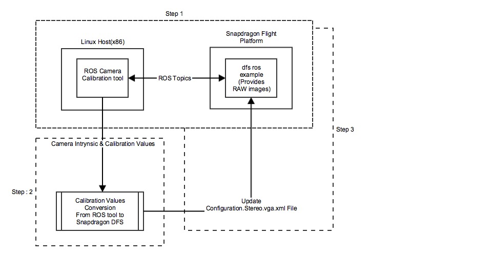

This document provides the step-by-step procedure for Snapdragon Flight<sup>TM</sup> Stereo Camera calibration

# Calibration work flow

The following diagram provides a pictorial of the Stereo Camera calibration based on ROS.



**NOTE:** The name of the calibration file is shown as an example only.  The name of the file can be anything as long as all the necessary XML fields are present.

There are three steps for the Stereo calibration process as listed below:

|Step#|Description|
|-----|-----------|
|1.| Run the ROS Camera Calibration tool & capture the calibration console output |
|2.| Convert the ROS calibration output to Snapdragon Flight<sup>TM</sup> Stereo calibration format|
|3.| Run the Snapdragon Flight<sup>TM</sup> DFS ROS example code | 


# Pre-requisites

## Hardware

This requires the Stereo Camera Kit from [Intrinsyc](https://www.intrinsyc.com/vertical-development-platforms/qualcomm-snapdragon-flight/)

## Software

The stereo camera calibration for Snapdragon Flight<sup>TM</sup> platform requires two hosts connected via network. 

One host runs ROS Camera Calibration tool and the other host runs the Snapdragon Flight<sup>TM</sup> DFS ROS example, as illustrated in the [Calibration Workflow](#calibration-work-flow).  The table below lists the requirements for both the hosts.

|     |x86 Linux Host|Snapdragon Flight<sup>TM</sup> platform|
|:----|:-------------|:--------------------------------------|
|1| Ubuntu 14.04 | <ul><li>[Intrinsyc Plaform Image 3.1.2](https://support.intrinsyc.com/attachments/download/1010/Flight_3.1.2_JFlash.zip)</li><li>[Camera Apr 1st 2017 Date fix](https://developer.qualcomm.com/forum/qdn-forums/hardware/snapdragon-flight/34157)</li><ul><li>Stereo camera will not work if not applied</li></ul></ul>|
|2| Install [ROS Indigo](http://wiki.ros.org/indigo/Installation/Ubuntu) | Install [ROS Indigo on Snapdragon Flight<sup>TM</sup>](https://github.com/ATLFlight/ATLFlightDocs/blob/master/SnapdragonROSInstallation.md) |
|3| <ul><li>Install [ROS Camera Calibration Tool](http://wiki.ros.org/camera_calibration)</li><ul><li>sudo apt-get install ros-indigo-camera-calibration</li></ul></ul>| Install [Snapdragon Flight<sup>TM</sup> DFS ROS Example](https://github.com/ATLFlight/dfs-ros-example) |

# Calibration Process

The stereo calibration is based on [ROS Camera Calibration Tool](http://wiki.ros.org/camera_calibration) and the calibration process defined [here](http://wiki.ros.org/camera_calibration/Tutorials/StereoCalibration)

The Linux host and the Snapdragon Flight<sup>TM</sup> board need to be connected via a IP network(wifi or ethernet). 

The  DFS ROS node runs on the Snapdragon Flight<sup>TM</sup> platform and provides stereo images via ROS topics. The ROS camera calibration tool runs on the Linux host and listens to the stereo image topics. 

## Step 1 - Starting ROS applications

* Start the DFS ROS node on Snapdragon Flight<sup>TM</sup>

  ```
  roslaunch snap_dfs dfs_test.launch config_filename:=/home/linaro/ros_ws/src/dfs-ros-example/calibration_example/Configuration.Stereo.vga.xml param_filename:=dfs_test.yaml
  ```

* Check Stereo image topics on Linux host

  Check to make sure that the DFS ROS example is running and we can see the ROS topics.  Here is an example command:

  ```
  rostopic hz /left/image_raw
  ```

  The above should shows the frame-rate for the left raw image which typically should be 30hz.

* Start ROS Camera Calibration on Linux host

  ```
  rosrun camera_calibration cameracalibrator.py --no-service-check --pattern 'acircles' --size 4x11 --square 0.058 right:=/right/image_raw left:=/left/image_raw
  ```

## Step 2 - Execute the ROS Camera calibration process

* Follow the ROS camera calibration process as described [here](http://wiki.ros.org/camera_calibration/Tutorials/StereoCalibration)

* This process uses 'asymmetric circles pattern'. The square size in this case is half of the actual square size.

* Once the calibration is done, verify the reprojection error by moving the board in front of the stereo rig. The calibration tool should show error in pixels.

* The calibration uses unrectified translation and rotation. These are output by the calibration tool in the console window of the linux host. This is not saved by the tool to an output file. **Take note of these values before existing the ROS Camera Calibration tool on linux host**.  Here is an example output snippet:

  ```
  Left:
  ('D = ', [0.031602525484087936, -0.050722270516241307, -0.006555901566521358, -0.002738716625100934, 0.0])
  ('K = ', [446.2290320506284, 0.0, 311.4076539499064, 0.0, 446.5275989734109, 219.00894123439343, 0.0, 0.0, 1.0])
  ('R = ', [0.9997758015185529, 0.020603269951446516, -0.00488384738119489, -0.02057341482219666, 0.9997698185300529, 0.006086424150455454, 0.005008123449836495, -0.005984582165301899, 0.9999695512743465])
  ('P = ', [468.70105847465044, 0.0, 301.6789894104004, 0.0, 0.0, 468.70105847465044, 214.7192039489746, 0.0, 0.0, 0.0, 1.0, 0.0])

  Right:
  ('D = ', [0.03698768644858235, -0.0715102419154736, -0.009498047611556636, -0.006757984956951077, 0.0])
  ('K = ', [442.5588910655802, 0.0, 308.1520868589191, 0.0, 443.1757325381602, 224.125189245515, 0.0, 0.0, 1.0])
  ('R = ', [0.9999117976255871, -0.007591650771936735, 0.010897880882249633, 0.00765729180932962, 0.999952716315019, -0.005994248606968518, -0.010851859348218793, 0.006077168154027222, 0.9999226495964146])
  ('P = ', [468.70105847465044, 0.0, 301.6789894104004, -37.65461254820579, 0.0, 468.70105847465044, 214.7192039489746, 0.0, 0.0, 0.0, 1.0, 0.0])
  ('self.T ', [-0.08033114208127567, 0.0006098997713999711, -0.0008755164401656283])
  ('self.R ', [0.9994757348268946, 0.02832192578067521, -0.015688340011393884, -0.028131955562350666, 0.9995297635865183, 0.012200195937635331, 0.016026495826508832, -0.011752456115752614, 0.9998024960994898])
  ```

## Step 3 - Convert the calibration values and update/create Snapdragon Flight<sup>TM</sup> DFS ROS calibration file

In this step, the ROS based calibration values will be updated/created to the expected format of [DFS ROS example](https://github.com/ATLFlight/dfs-ros-example).  If creating a new file, make sure all the parameters defined in the example file are included.

**NOTE:** This is a limitation of the current release and will be updated in future releases to avoid this conversion.

* Camera Intrynsics - Use the ROS calibration values of "D" and "K" for camera intrynsics
* Stereo Calibration parameters
  * Use Self.T Vector --> Translation
  * Use Self.R Matrix --> Rotation matrix(3x3)

Refer to [this page](http://docs.ros.org/api/sensor_msgs/html/msg/CameraInfo.html) for additional information regarding the ROS camera calibration parameters.

DFS ROS example expects the rotation in scaled axis-angle representation (3x1 vector). Refer to [this](https://en.wikipedia.org/wiki/Rotation_formalisms_in_three_dimensions#Rotation_matrix_.E2.86.94_Euler_axis.2Fangle
 ) wiki link for additional infomation. The 3x3 Rotation Matrix from ROS camera calibration output (`self.R`) can be converted to the required vector representation using the following MATLAB code snippet. Users could also use their preferred tool/language for the conversion.

```matlab
axis_angle = vrrotmat2vec(self.R); % where self.R is the 3x3 matrix, axis_angle is 4x1: (unit vector 3x1, angle 1x1)
scaled_axis_angle = axis_angle(1:3).* axis_angle(4); % scaled_axis_angle is the 3x1 representation required by DFS
``` 

Here is an example [jsfiddle snippet](https://jsfiddle.net/1gej4qyp/) to convert a rotation matrix to scales-axis representation.  

  * Update the DFS Stereo Camera Calibration file( example file Configuration.Stereo.vga.xml ).  
  Here is the field mapping from ROS to DFS Calibration Format


|ROS Variable| DFS Calibration Variable|
|:----------:|-----------------------|
| [D](http://docs.ros.org/api/sensor_msgs/html/msg/CameraInfo.html) | radial_distortion |
| [K](http://docs.ros.org/api/sensor_msgs/html/msg/CameraInfo.html) | focal_length and principal_point |
| Self.T | translation |
| Converted Self.R | rotation |


